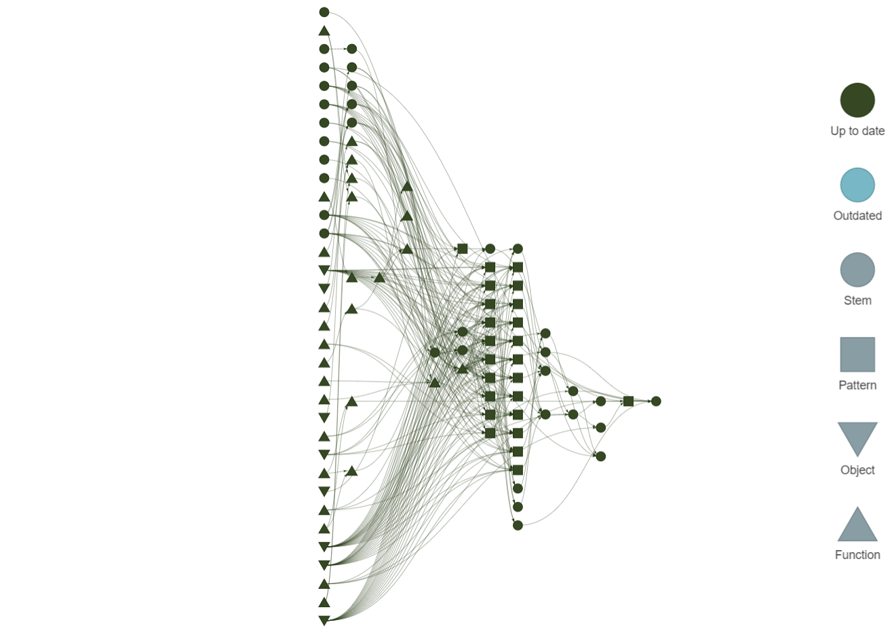

# Multiple imputation of missing covariates when using the Fine&ndash;Gray model

**Authors**: Edouard F. Bonneville, Jan Beyersmann, Ruth H. Keogh, Jonathan W. Bartlett, Tim P. Morris, Nicola Polverelli, Liesbeth C. de Wreede, and Hein Putter

## Abstract

The Fine&ndash;Gray model for the subdistribution hazard is commonly used for estimating associations between covariates and competing risks outcomes. When there are missing values in the covariates included in a given model, researchers may wish to multiply impute them. Assuming interest lies in estimating the risk of only one of the competing events, this paper develops a substantive-model-compatible multiple imputation approach that exploits the parallels between the Fine&ndash;Gray model and the standard (single-event) Cox model. In the presence of right-censoring, this involves first imputing the potential censoring times for those failing from competing events, and thereafter imputing the missing covariates by leveraging methodology previously developed for the Cox model in the setting without competing risks. In a simulation study, we compared the proposed approach to alternative methods, such as imputing compatibly with cause-specific Cox models. The proposed method performed well (in terms of estimation of both subdistribution log hazard ratios and cumulative incidences) when data were generated assuming proportional subdistribution hazards, and performed satisfactorily when this assumption was not satisfied. The gain in efficiency compared to a complete-case analysis was demonstrated in both the simulation study and in an applied data example on competing outcomes following an allogeneic stem cell transplantation. For individual-specific cumulative incidence estimation, assuming proportionality on the correct scale at the analysis phase appears to be more important than correctly specifying the imputation procedure used to impute the missing covariates.

## Usage 

The analyses for this article are structured using the [`{targets}`](https://github.com/ropensci/targets) R package. Code for the individual targets are in the [_targets.R](./_targets.R) file.



Given the data, reproduce the analysis using

``` r
targets::tar_make()

# Or to use parallel computation:
#targets::tar_make_future(workers = future::availableCores())
```

which produces: 

- [simulation-results.md](./analysis/simulation-results.md), the file with all simulation study results.
- [supplementary-material.pdf](./analysis/supplementary-material.pdf), the supplementary materials pdf submitted together with the manuscript.

Furthermore, the project uses [`{renv}`](https://rstudio.github.io/renv/articles/renv.html) to track its R package dependencies.

## Additional points

To use this methodology, you can either:

- Work with the [minimal code](https://github.com/survival-lumc/FineGrayCovarMI/blob/bc79b8a6496b22343da67996b2c3317f0d900b79/analysis/supplementary-material.qmd#L136) provided with the manuscript.
- Use a wrapper function, which will be available in the `{smcfcs}` R package - see [here](https://github.com/edbonneville/smcfcs/blob/finegray/R/smcfcs.finegray.R).
