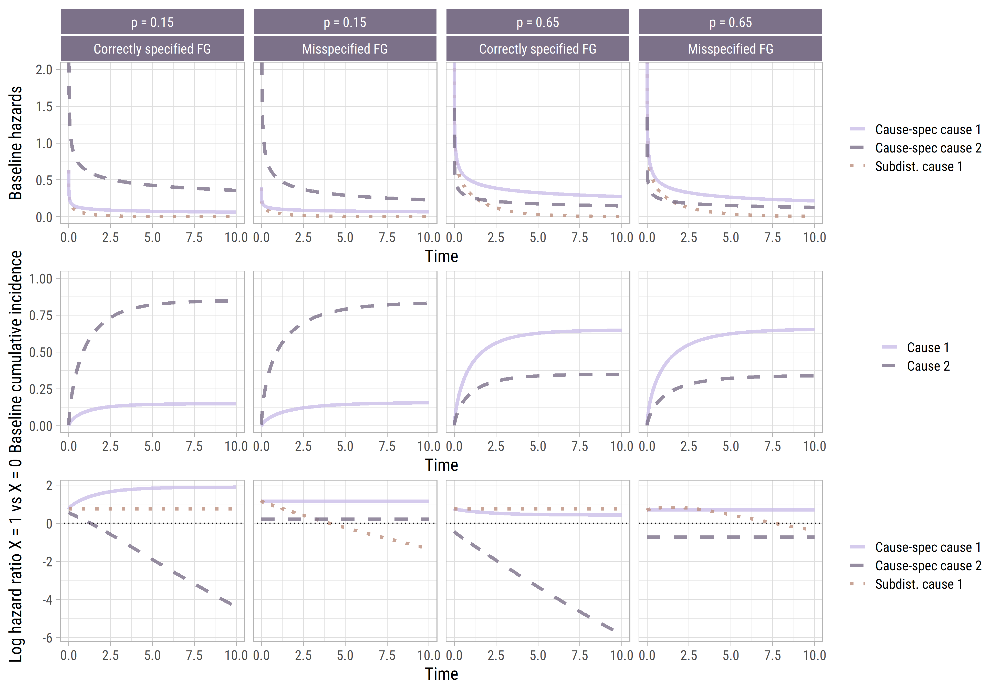
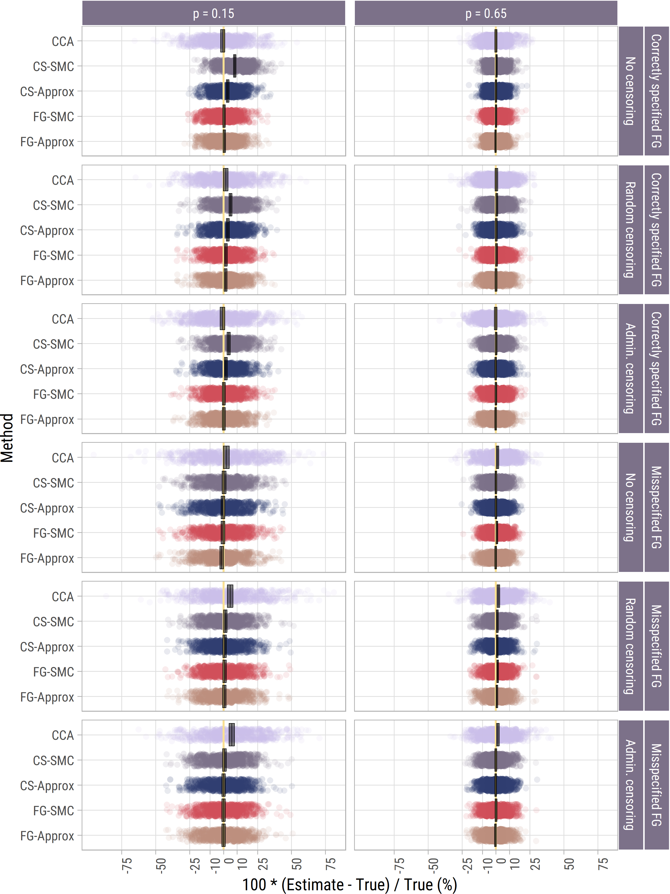
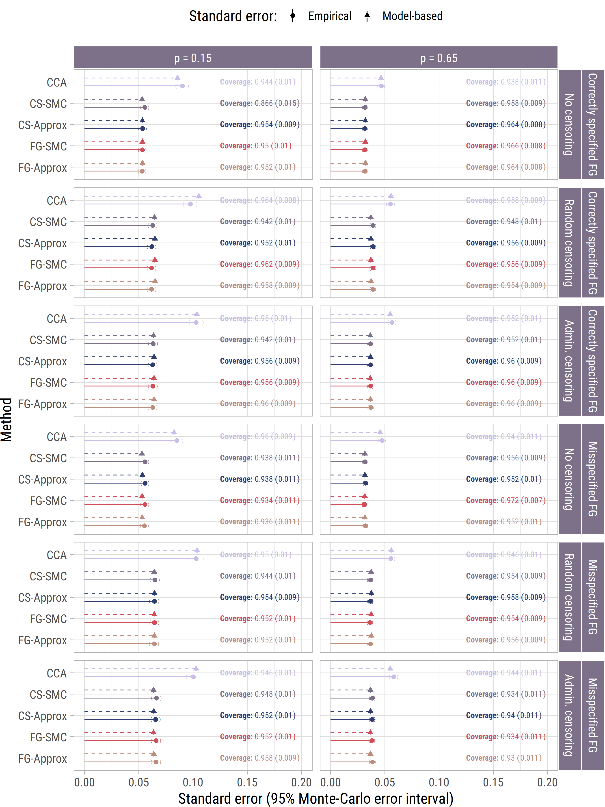
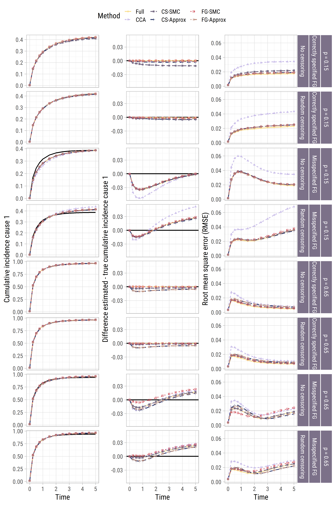
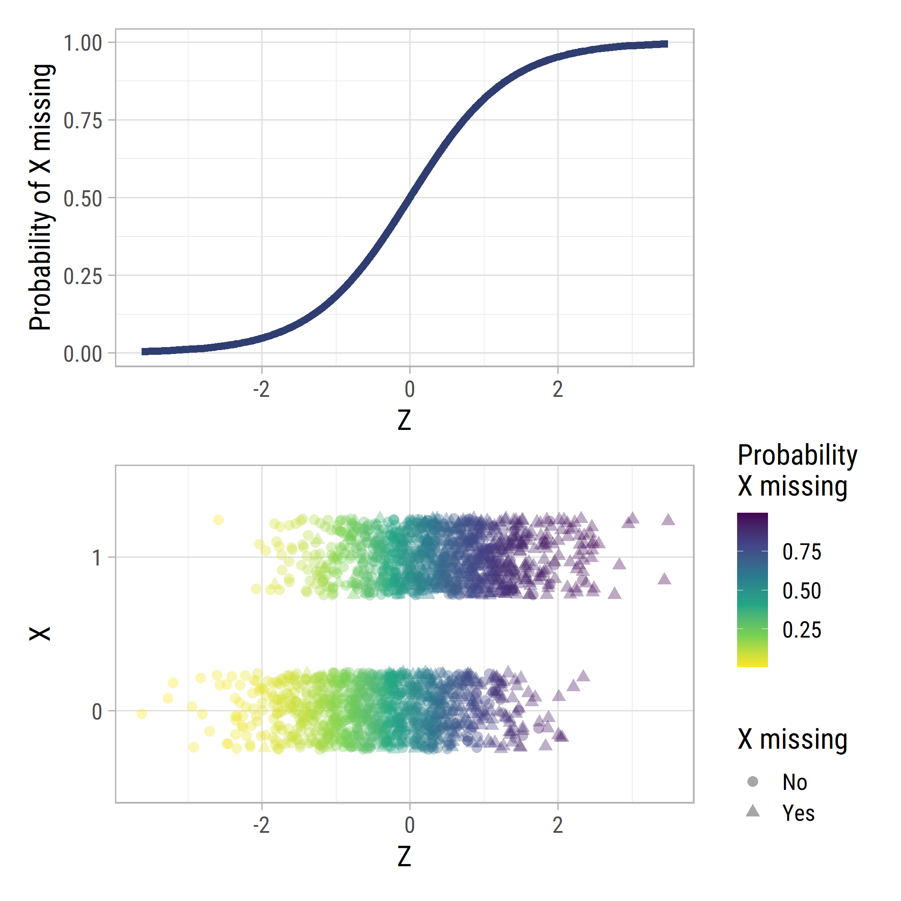

# Simulation study

- [Scenarios set-up](#scenarios-set-up)
- [Log subdistribution hazard
  ratios](#log-subdistribution-hazard-ratios)
  - [Relative bias](#relative-bias)
  - [Standards errors/coverage](#standards-errorscoverage)
- [Cumulative incidences](#cumulative-incidences)
  - [Performance](#performance)
- [Miscellaneous](#miscellaneous)
  - [Covariates and missing data
    mechanism](#covariates-and-missing-data-mechanism)
  - [Censoring plots](#censoring-plots)

## Scenarios set-up

## Log subdistribution hazard ratios

### Relative bias

#### X

#### Z

### Standards errors/coverage

#### X

#### Z

## Cumulative incidences

### Performance

#### Baseline

#### Higher risk

## Miscellaneous

### Covariates and missing data mechanism

### Censoring plots

